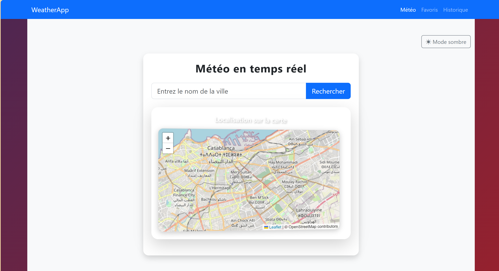
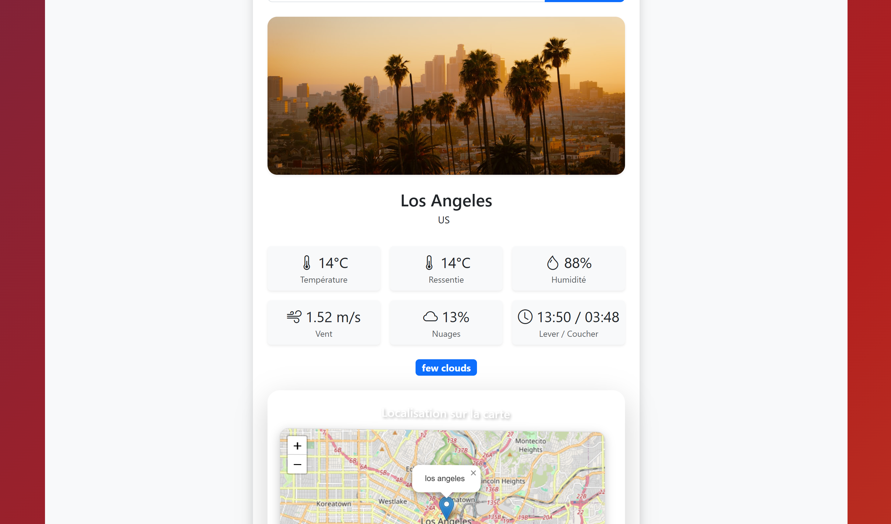
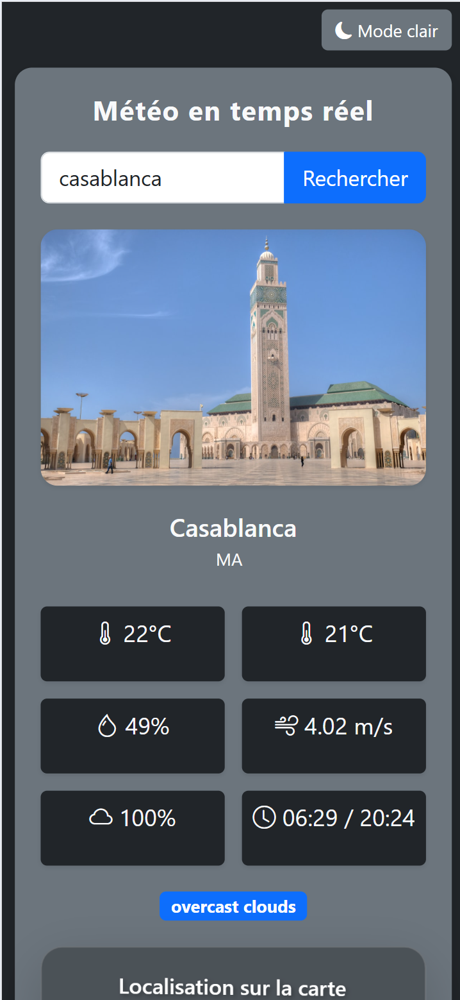

# Application Météo Angular

Une application météo moderne et interactive construite avec Angular, offrant des prévisions météorologiques en temps réel.

## 🌟 Fonctionnalités

- Recherche de météo par ville
- Affichage des conditions météorologiques actuelles
- Navigation entre les pages
- Interface utilisateur moderne et responsive
- Animations fluides
- Thème dynamique qui change selon la météo

## 🛠️ Technologies utilisées

- Angular 19
- TypeScript
- HTML5/CSS3
- API Météo (OpenWeatherMap)
- API pour les photos (unsplash)
- RxJS pour la gestion des observables

## 📸 Captures d'écran





## 🚀 Installation

1. Clonez le repository :
```bash
git clone https://github.com/Saakoon/angular-weather-app.git
```

2. Installez les dépendances :
```bash
cd angular-weather-app
npm install
```

3. Lancez l'application :
```bash
ng serve
```

4. Ouvrez votre navigateur à l'adresse `http://localhost:4200`

## 📝 Configuration

Créez un fichier `environment.ts` dans `src/environments/` avec votre clé API OpenWeatherMap :

```typescript
export const environment = {
  production: false,
  apiKey: 'VOTRE_CLE_API'
};
```

## 🤝 Contribution

Les contributions sont les bienvenues ! N'hésitez pas à :
1. Fork le projet
2. Créer une branche pour votre fonctionnalité
3. Commiter vos changements
4. Pousser vers la branche
5. Ouvrir une Pull Request

## 📄 Licence

Ce projet est sous licence MIT. Voir le fichier `LICENSE` pour plus de détails.

## 👨‍💻 Auteur

- **DRAISSI SAAD** - [GitHub](https://github.com/Saakoon)

## 🙏 Remerciements

- OpenWeatherMap pour leur API
- La communauté Angular
- Tous les contributeurs
